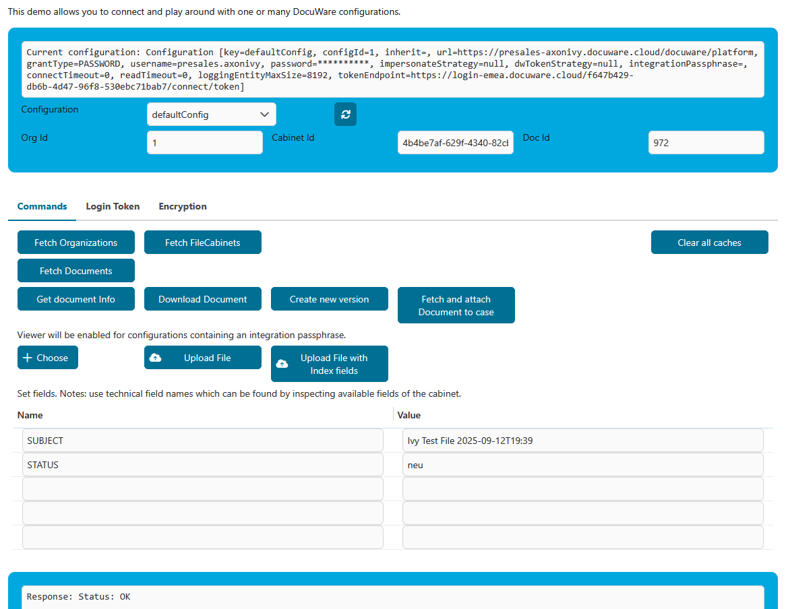

# DocuWare Connector

[DocuWare](https://start.docuware.com/) offers cloud-based document management and workflow automation software. It can be used to digitize, archive and process any business documents in an audit-proof manner to optimize your company's core processes.

The Axon Ivy DocuWare connector enables efficient integration of DocuWare functionalities into your Axon Ivy process applications

This connector:

- minimizes your integration effort: use the demo to see examples of API calls.
- is based on REST web service technologies.
- gives you access to the DocuWare REST API.

## Demo

The demo offers
- a GUI to navigate to one or more DocuWare instances
- a GUI to view and edit document properties of the default DocuWare instance
- some log-file-based example workflows

Before you start the demo, unpackit and provide at least one configuration for a DocuWare instance in global variables.

### Docuware Demo

DocuWare Demo provides a complex GUI to play around with some DocuWare functions and one or more DocuWare configurations. Not all features will be available at all times. To use all demo features, you should provide multiple configurations with all different grant types. Most buttons have a validation check and will only be visible when they are also usable, e.g. when a cabinet id is available. In some situations it might be necessary to use the refresh button. The following functions can be tested:

- using the default or any other configuration
- using configuration of grant type `dwtoken` with a provided or generated login token
- fetching organizations
- fetching cabinets
- fetching documents
- get document fields
- download of a document
- creating a new version of a document
- attaching a document to an Ivy case
- uploading a document
- uploading a document with index fields
- viewing files with the embedded DocuWare viewer (if the configuration has an `integrationPassphrase` set and your DocuWare installation allows embedding in a frame - check your DocuWare#s content security policy!)
- encrypting and decrypting parameters for embedding



### Document Table

Start **Document Table** to get basic viewer showing how to add, change, view and delete documents. Note, that viewing of documents might require additional setup of your DocuWare installation's content security
policy  to allow embedding
of DocuWare frames into your AxonIvy frames.

   

**Document Properties Editing**  
Modify document properties, including metadata and custom fields.

   

**Document Deletion**  
Delete documents from the file cabinet.

   

### Other demos

Other process starts show examples of DocuWare usage.

## Setup

Before any interactions between the Axon Ivy Engine and DocuWare services can be run, they have to be introducted to each other. This connector offers _multi-instance_ support, i.e. it allows to work with multiple DocuWare instances in parallel. Instance configurations are stored in global variables in named _blocks_ of configuration variables below the `docuwareConnector` section. The configuration named `defaultConfig` is predefined in the connector so you only have to set specific values for your installation. Additionally, configurations can configure the `inherit` attribute to take over all non-empty values of the named configuration.

Please see the provided `variables.yaml` file for the list and meaning of global variables. The most important will be shortly described here.

### `configId`

Any value that identifies this version of the configuration. If the value changes, the cached configuration will be re-read next time needed. It might be a good idea to put there a timestamp and the username doing the change.

### `inherit`

Any value which is **non-existent, empty or blank** in the current configuration will be looked up in the configuration mentioned in this variable. The lookup will be done recursively.

### `grantType`

This is the grant-type of your configuration. Possible values are `password`, `trusted`, `dwtoken`

#### `password`

Grant type `password` uses a fixed `username` and `password` to connect to your DocuWare instance. This means, that all operations will be performed by this user. Also all history entries will be show this user. It is a simple setup for a _technical user_ to connect to a cloud or on-premise instance of DocuWare.

#### `trusted`

Grant type `trusted` uses a `username` and `password` to connect as a trusted user to your DocuWare instance.Currently, DocuWare supports trusted users only for on-premise installations. The trusted user is not used directly, but impersonates another user. Which user to impersonate can be configured in the global variable `impersonateUser`.

`impersonateUser` implements a special syntax to define which user to use for accesses by anonymous Ivy user, accesses by the system Ivy user and accesses by other Ivy users.

- use a constant username for all situations
- use constant user names for anonymous and system, but use the Ivy username for others
- set the username to use in the user's session before any calls and use this name

Please see the documentation in the `variables.yaml` file.

#### `dwtoken`

The token is generated by using an existing token of DocuWare. Note: This use-case is probably not fully supported. Which token to use is configured in `dwToken`. Currently, the existing token can only be loaded from the session.

### Other configuration variables

Other configuration variables are documented directly in the variables supported by the connector. Please see there for a description and copy it to your project, if you are using it, so that it will be visible in the Engine cockpit for your application.

```
@variables.yaml@
```

If the connector misses features that you need, you can unpack it to your project and extend it there. In this case consider to propose/offer your change to the Axon Ivy market.

